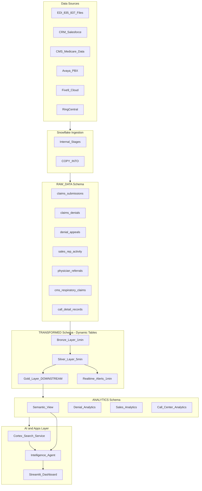
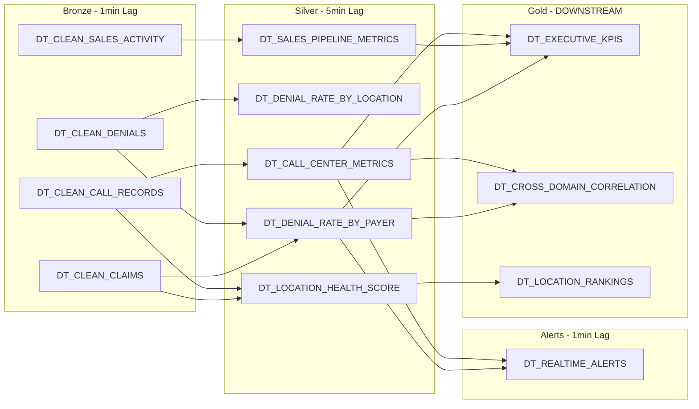
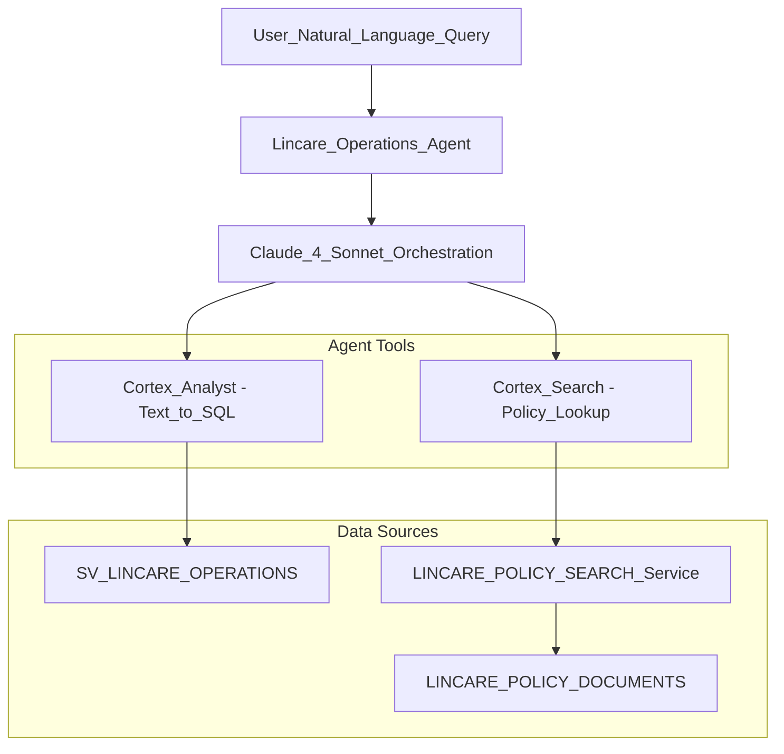
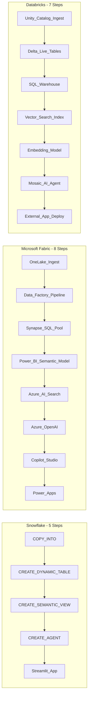
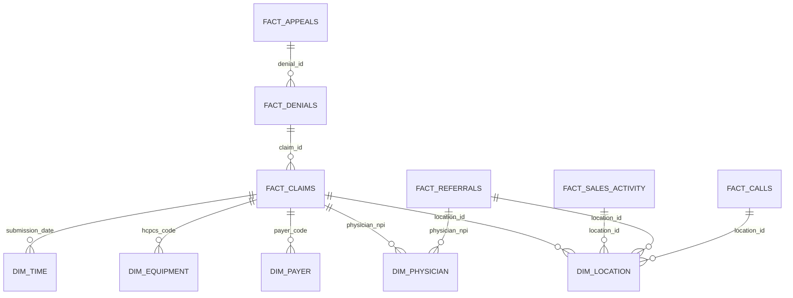
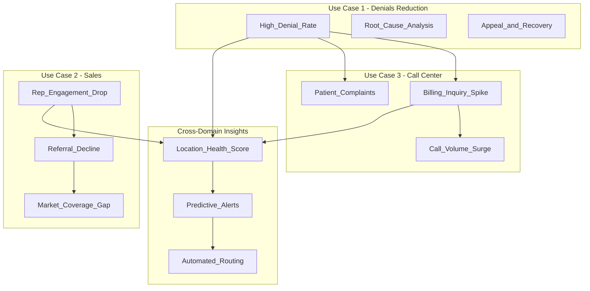

# Lincare SnowDay Demo - Architecture Diagrams

## Overall Platform Architecture

## Dynamic Tables Pipeline (Medallion Architecture)

## Intelligence Agent Architecture

## Competitive Architecture Comparison

## Data Model (Star Schema)

## Use Case Integration (Cross-Domain Value)

